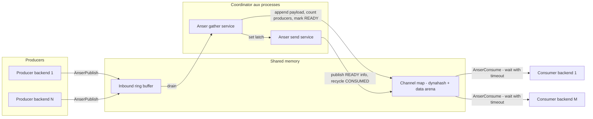
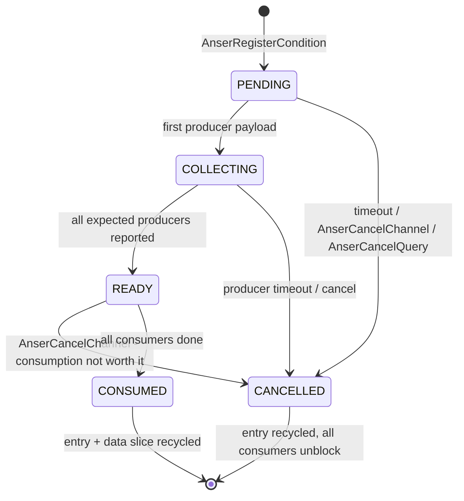

<!--
  Licensed to the Apache Software Foundation (ASF) under one
  or more contributor license agreements.  See the NOTICE file
  distributed with this work for additional information
  regarding copyright ownership.  The ASF licenses this file
  to you under the Apache License, Version 2.0 (the
  "License"); you may not use this file except in compliance
  with the License.  You may obtain a copy of the License at

   http://www.apache.org/licenses/LICENSE-2.0

  Unless required by applicable law or agreed to in writing,
  software distributed under the License is distributed on an
  "AS IS" BASIS, WITHOUT WARRANTIES OR CONDITIONS OF ANY
  KIND, either express or implied.  See the License for the
  specific language governing permissions and limitations
  under the License.
-->

# Anser Subsystem — PR 1: Channel Map + Background Services

## Background

This is the first PR in a series that brings an **Anser-style adaptive
information sharing framework** (per the VLDB paper *"Anser: Adaptive
Information Sharing Framework of AnalyticDB"*, p3636-wu) to Apache
Cloudberry. The end goal is to gather **bloom filters from producers**
(hash-join build sides) and deliver them to **consumers** (probe sides)
so data can be filtered out *before* an expensive hash join is
performed.

The paper's model has three roles:

| Paper concept | Role |
|---|---|
| **Publisher** | Operator that collects runtime information (e.g. a bloom filter from the build side of a hash join) |
| **Subscriber** | Operator that consumes it (e.g. a filter above the probe side) |
| **Channel manager** | Logical part: publisher↔subscriber relationship map + information lifecycle state |
| **Channel service** | Physical part: push-based transfer, expected-partition counting, cancellation flags, memory caps |

## Scope of this PR

**In scope:**

1. A **shared-memory channel map** holding producer/consumer properties
   and information state (the channel manager).
2. **Two coordinator-only background services** (the channel service):
   - a *gather* service that receives data from producers;
   - a *send* service that makes aggregated data available to consumers.
3. A **publish/consume C API** over a shared-memory queue, organized
   around registered **conditions** (see the identity model below).
4. A **test module** with debug SQL functions so the whole pipeline is
   testable end-to-end immediately.

**Out of scope (later PRs):** bloom-filter payloads and merging, planner
PubNode/SubNode matching (including generation of the condition symbols,
see below), executor integration, segment-local services, network (RPC)
transport.

## Identity model: queries, conditions, channels

A single query may carry **multiple channels**, and a channel must be
matched to specific producers/consumers in the plan tree. The model:

- **Query identity** — `(gp_session_id, gp_command_count)` (*ssid +
  ccnt*), the standard Cloudberry way to identify a running command;
  no separate `query_id` is introduced.
- **Condition** — the unit of registration. Per the paper (§3.3), the
  global context is a key-value hash map whose keys and values are
  *"symbols … generated by the optimizer through algebraic equivalence
  that uniquely mark an attribute of the same sub-expression"* — i.e.
  the precise matching key is an optimizer-generated equivalence-class
  symbol of the (join) attribute, **not** a table name + join condition
  (that is only an intuitive approximation). Since planner integration
  is a later PR, in this PR the condition carries an **opaque
  fixed-length condition key** (bytes chosen by the caller / test
  module); the planner PR will populate it with the real
  equivalence-class symbols.
- **Channel** — one registered condition inside one query:
  `channel key = (ssid, ccnt, condition_id)`. Each channel has one set
  of producers and **one or more consumers** — one producer's result
  can be consumed by multiple subscribers in different parts of the
  plan tree (the paper's one-to-many passing).

Registration flow: a query registers its conditions up front (one per
piece of adaptive information), producers attach and publish, and
specific parts of the plan tree subscribe to the condition they need.

## Architecture

### Channel lifecycle

Cancellation semantics (three levels):

1. **Whole query** — `AnserCancelQuery(ssid, ccnt)`: query failed or
   finished; all its channels are cancelled/recycled.
2. **Single channel** — `AnserCancelChannel(channel)`: the step
   completed, or a subscriber decides the data is not worth consuming
   (cost outweighs benefit, per the paper's SubOperator thresholds).
3. **Producer failure** — if a producer fails or times out, the gather
   service marks the channel `CANCELLED`, which unblocks **all**
   consumers of that producer at once (the paper's cancellation flag,
   distinguishing "empty info" from "failed/cancelled").

## New code

### `src/backend/cdb/anser/` + `src/include/cdb/anser.h`

New subdirectory, modeled on [`src/backend/cdb/endpoint/`](../src/backend/cdb/endpoint/).

**`anser.c` — the channel manager:**

- Shmem **dynahash** of channel entries keyed by
  `(ssid, ccnt, condition_id)`. Each entry holds: the opaque condition
  key, state enum (`PENDING → COLLECTING → READY/CANCELLED →
  CONSUMED`), cancellation flag, expected/done producer counts,
  consumer count/done, data length, and an offset into a fixed data
  arena.
- **Fixed shmem pool** sized at postmaster start:
  `gp_anser_max_channels` hash entries +
  `gp_anser_max_channels × gp_anser_max_info_size` data arena.
  On pool exhaustion, registration first runs an **orphan sweep** —
  recycling entries in terminal states (`CONSUMED`/`CANCELLED`) and
  entries whose owning session/command is no longer alive — and
  retries; only if the pool is still full does registration fail with
  a `WARNING`. Publishers are advisory (information tunes performance,
  never affects correctness), so failing open is safe. LRU eviction
  per the paper's 200MB budget is a follow-up.
- An **inbound message ring buffer** (producers → gather service) plus
  shared latches to wake the two services.
- **Locking:** two named individual LWLocks added to
  [`lwlocknames.txt`](../src/backend/storage/lmgr/lwlocknames.txt) —
  `AnserChannelLock` (channel hash + arena) and `AnserRingLock` (ring
  buffer) — following the existing `ParallelCursorEndpointLock`
  precedent (entry 59). *(Correction vs. the draft plan: a named-tranche
  LWLock is the extension mechanism; in-core subsystems use
  lwlocknames.txt.)*
- **Public API:**
  - `AnserShmemSize()` / `AnserShmemInit()`
  - `AnserRegisterCondition(ssid, ccnt, condition_key, n_producers)`
    → channel handle; a query registers each of its conditions once
  - `AnserSubscribe(channel)` — a consumer (a specific part of the
    plan tree) subscribes to a registered condition; many subscribers
    per channel are allowed
  - `AnserPublish(channel, payload, len)` — producer enqueues its
    partial result on the ring
  - `AnserConsume(channel, ...)` — *weak dependency*: block up to
    `gp_anser_timeout_ms`, then cancel this subscription and proceed
  - `AnserChannelGetState(channel)`
  - `AnserCancelChannel(channel)` — cancel one channel (step done, or
    consumption judged not beneficial)
  - `AnserCancelQuery(ssid, ccnt)` — cancel and recycle all channels
    of a query (query failure or normal end)

**`anserservice.c` — the two auxiliary processes:**

- **Gather service:** drains the ring buffer, appends payloads to the
  channel's arena slice, increments the done-producer count; when all
  expected producers have reported → state `READY` → set the send
  service's latch. On producer timeout or cancellation flag →
  `CANCELLED`, unblocking all consumers of that producer.
- **Send service:** for `READY` channels, makes the aggregated
  information available to consumers (wakes waiters); once all
  consumers are done → `CONSUMED` → recycle entry and data slice.
  Also cancels channels stuck beyond the timeout so blocked
  subscribers unblock.
- Both are standard latch-wait loops: `WaitLatch` with
  `WL_EXIT_ON_PM_DEATH`, `SIGHUP` config reload, `SIGTERM` exit.

**`Makefile`** — modeled on [`cdb/endpoint/Makefile`](../src/backend/cdb/endpoint/Makefile).

### Test module `src/test/modules/anser/`

Modeled on [`src/test/modules/test_shm_mq/`](../src/test/modules/test_shm_mq/):
a small extension exposing SQL wrappers over the in-core API —
`anser_test_register_condition()`, `anser_test_subscribe()`,
`anser_test_publish()`, `anser_test_consume()`, `anser_test_state()`,
`anser_test_cancel_channel()`, `anser_test_cancel_query()` — plus a
regression test covering:

1. the happy path: register condition → subscribe ×M → publish ×N →
   `READY` → consume ×M → `CONSUMED` → entry recycled;
2. multiple conditions in one query, cancelled together by
   `anser_test_cancel_query()`;
3. single-channel cancel: `READY` → `anser_test_cancel_channel()` →
   consumers return without data;
4. the timeout path: register → (no publish) → consume blocks →
   `CANCELLED` after `gp_anser_timeout_ms`, all consumers unblock;
5. pool exhaustion: fill the pool with terminal-state entries, verify
   the orphan sweep recycles them and registration still succeeds.

## Touched existing files

| File | Change |
|---|---|
| [`src/backend/cdb/Makefile`](../src/backend/cdb/Makefile) | Add `anser` to `SUBDIRS` |
| [`src/backend/storage/lmgr/lwlocknames.txt`](../src/backend/storage/lmgr/lwlocknames.txt) | Add `AnserChannelLock`, `AnserRingLock` |
| [`src/backend/storage/ipc/ipci.c`](../src/backend/storage/ipc/ipci.c) | Hook `AnserShmemSize()` into `CalculateShmemSize` next to `EndpointShmemSize()` (line ~226) and `AnserShmemInit()` under `!IsUnderPostmaster` next to `EndpointShmemInit()` (line ~446); both no-ops when `gp_anser_enable` is off |
| [`src/backend/postmaster/postmaster.c`](../src/backend/postmaster/postmaster.c) | Two new `PMAuxProcList` entries (gather + send), same idiom as the `pg_cron launcher` entry (line 442); start rule: `gp_anser_enable && Gp_role == GP_ROLE_DISPATCH` (coordinator-only, like `PgCronStartRule`) |
| [`src/include/postmaster/postmaster.h`](../src/include/postmaster/postmaster.h) | `MaxPMAuxProc` base constant `4 → 6` (line 110: `(4 + IC_PROXY_NUM_BGWORKER + FTS_NUM_BGWORKER)`) |
| [`src/backend/utils/misc/guc_gp.c`](../src/backend/utils/misc/guc_gp.c) | New GUCs (see below). *(Correction vs. the draft plan: Cloudberry `gp_*` GUCs live in `guc_gp.c`, not `guc_tables.c`.)* |
| [`src/test/modules/Makefile`](../src/test/modules/Makefile) + `meson.build` | Add the `anser` test module |

### GUCs

| GUC | Default | Context | Purpose |
|---|---|---|---|
| `gp_anser_enable` | `off` | `PGC_POSTMASTER` | Master switch. When off: **no shmem allocated, no workers registered**; enabling requires a restart. |
| `gp_anser_max_channels` | `128` | `PGC_POSTMASTER` | Channel hash size / arena slot count (sizes shmem) |
| `gp_anser_max_info_size` | `1MB` | `PGC_POSTMASTER` | Per-record memory cap, per the paper (sizes shmem) |
| `gp_anser_timeout_ms` | `1000` | `PGC_USERSET` | Weak-dependency wait budget for consumers |

The three shmem-sizing GUCs must be `PGC_POSTMASTER` because the pool
is fixed at postmaster start.

## Deliberate simplifications vs. the paper

Documented in code comments:

1. **Coordinator-only** — no segment-local services or RPC transport
   yet (paper §3.3, "Information transmission").
2. **Fixed pool + orphan sweep** instead of the paper's 200MB
   LRU-evicted service budget (§3.4).
3. **"Aggregation" is byte-concatenation** — real bloom-filter union
   arrives with the bloom-filter PR (§3.2, information merging).
4. **Opaque condition keys** — the optimizer-generated
   algebraic-equivalence symbols (§3.3) arrive with the planner PR;
   until then the caller supplies the key bytes.
5. **ACK/retry is trivial in-shmem** — the cancellation flag and
   expected-producer counting do follow the paper (§3.3).

## Validation

1. Compile `src/backend/cdb/anser` and the full backend.
2. Run the test module's regression suite
   (`make -C src/test/modules/anser installcheck`).
3. Smoke-test on a demo cluster with `gp_anser_enable=on`:
   - both aux processes visible in `ps` on the coordinator;
   - nothing starts with the GUC off, or on segments regardless.
4. Report exactly what was run; do not claim untested results.

## Risks and review notes

- Touches **postmaster startup** and **shared-memory sizing** — both
  high-risk areas; changes are additive and fully gated behind an
  off-by-default `PGC_POSTMASTER` GUC.
- No SQL-visible behavior, catalog, on-disk, or protocol changes.
- `MaxPMAuxProc` bump affects the static aux-worker array; verify no
  other list consumers assume the old count.
- The consume path blocks backends (bounded by `gp_anser_timeout_ms`);
  the timeout-cancel path in the send service is the safety net and
  must be covered by the regression test.
- The orphan sweep must take `AnserChannelLock` exclusively and be
  careful about liveness checks for `(ssid, ccnt)` owners so it never
  recycles a channel still in use.
